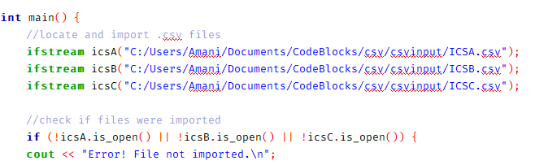
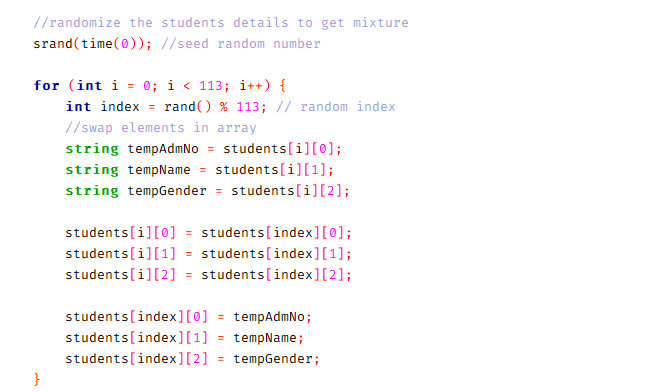

# Sorting C++

## Project Description

C++ program that takes input from multiple csv files with three defined data items, merges the information and afterwards, dividing the merged records into two.

## Problem Statemet

The objective of this task is to collect student data from multiple files, merge them and divide the records into two. These records are to be used to merge student groups, studying the same course. The program therefore is to create two groups of randomly selected students that have been merged from their previous groups.

## How it Works

The program begins by searching for the csv files specified for sorting, and checking if the import is done.

The program then fetches data from all the files imported and stores them in arrays which are thereafter merged

The merged data is then randomised, shuffled to get a mixture of all the data imported from the original files. This ensures that all students have a 50% chance of being in either of the two groups to be created as the final result

The new groups are then created from spliting the randomised data

Finally the new records are populated and saved in csv format

## Code Editor

[CodeBlocks](https://www.codeblocks.org/)
